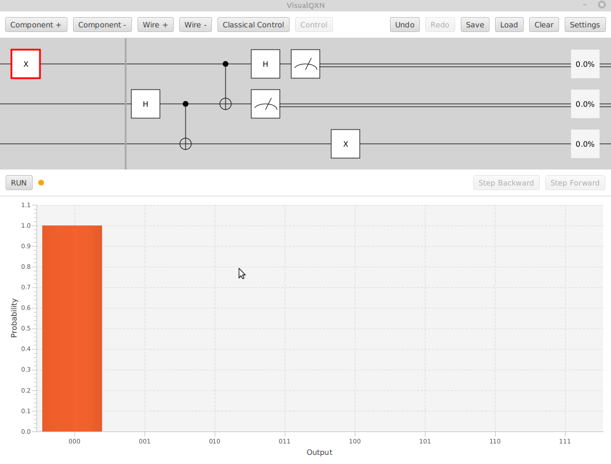

# VisualQXN

[Releases](https://github.com/armytricks/VisualQXN/releases/latest) | [License](LICENSE)

**UNMAINTAINED:** I no longer have the time to develop this GUI to a stable state. Use at your own risk.

**VisualQXN** is a graphical toolkit for simulating and debugging small quantum algorithms as circuits.

VisualQXN is a graphical wrapper for the [qxn](https://github.com/armytricks/qxn) library and maintains all of its
functionality and implements additional graphical debugging tools including:
- Break points
- Step forward/backward
- Composite state probabilities
- Qubit measurement probabilities

## Quick Start
1. Download the latest [release](https://github.com/armytricks/VisualQXN/releases/latest)
2. (Mac/Linux Only) Ensure the `.jar` file is executable (you may need to use `chmod +x VisualQXN-*.jar`)
3. Run the jar file (if opening it fails, try `java -jar VisualQXN-*.jar`)

## Features

- Set of common prebuilt gates
- Custom matrix-defined gates
- Custom inequality-defined oracles
- Classical control of gates using measurements
- Toggle and control any type of gate
- Set break points and step through state of circuit
- Save and load circuits to preserve your projects

## Requirements
- Operating System: Windows / Mac OS / Linux
- Dependencies: Java Runtime Environment (JRE) 8+
